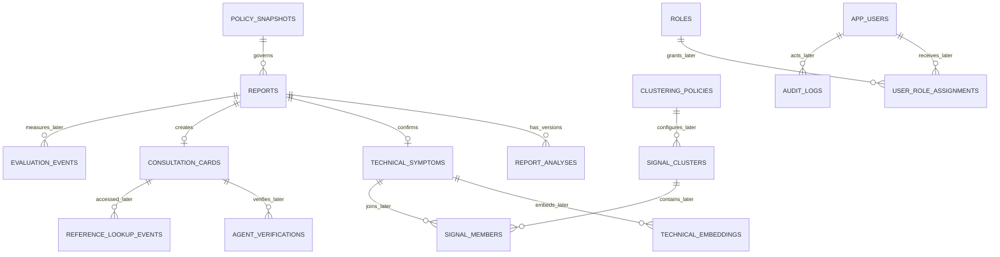
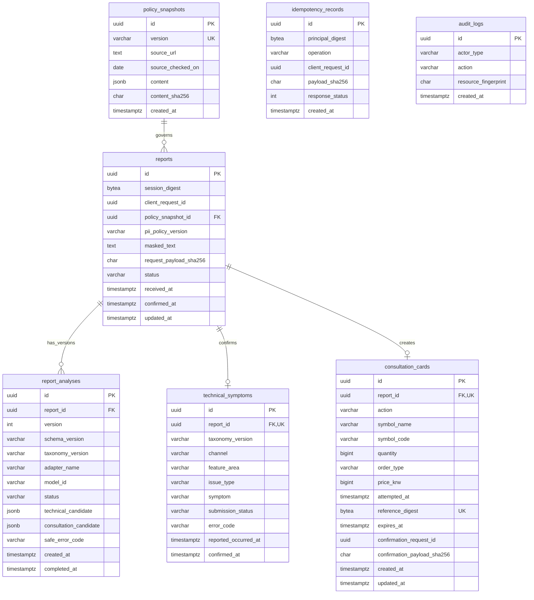

# MTS SOS Desk ERD

## 전체 MVP 논리 ERD

## 현재 물리 ERD

후속 migration이 추가될 때 이 문서에도 실제 반영된 엔터티와 관계를 누적한다. 아래 데이터
경계는 일정과 무관하게 유지한다.

## 데이터 경계

- `reports`에는 마스킹된 텍스트와 HMAC session digest만 저장한다.
- 검증된 AI 후보는 versioned `report_analyses`에만 JSONB로 저장한다.
- 확정 기술정보와 주문상담정보는 각각 `technical_symptoms`, `consultation_cards`로
  물리 분리한다.
- `technical_symptoms`에는 종목·수량·가격·매매 방향 컬럼이 없다.
- 참조번호 digest·TTL·삭제 멱등 기록·비식별 삭제 감사는 구현되어 있다.
- vector·군집·상담원 역할과 조회 감사는 후속 migration에서 추가한다.
