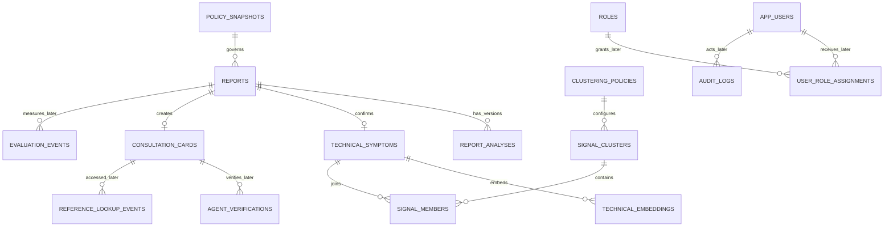
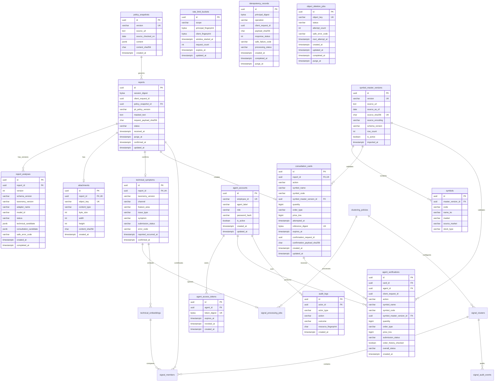

# MTS SOS Desk ERD

## 전체 MVP 논리 ERD

## 현재 물리 ERD

후속 migration이 추가될 때 이 문서에도 실제 반영된 엔터티와 관계를 누적한다. 아래 데이터
경계는 일정과 무관하게 유지한다.

## 장애 신호 물리 테이블

| 테이블 | 핵심 물리 필드·제약 |
|---|---|
| `clustering_policies` | version UK, EXPERIMENTAL/APPROVED/RETIRED, window/min/threshold, model metadata, active partial UK |
| `technical_embeddings` | symptom FK cascade, dimensionless vector, model metadata UK, `vector_dims` CHECK |
| `signal_processing_jobs` | report·symptom FK cascade/UK, policy FK restrict, status, attempt, lease/next retry, safe error |
| `signal_clusters` | policy FK, 상태·종료사유 CHECK, hard-gate fields, raw/distinct count, notice metadata, purge_at |
| `signal_members` | signal·report·symptom·embedding FK, `(signal_id, report_id)` UK, join similarity |
| `signal_audit_events` | signal FK set null, operator FK restrict, 상태 before/after, 안전한 reason, purge_at |

`reports`가 계속 업무 데이터 삭제 root다. report 삭제 cascade 전에 서비스가 membership을 명시적으로
제거하고 같은 transaction에서 cluster count·상태를 다시 계산한다.

## 데이터 경계

- `reports`에는 마스킹된 텍스트와 HMAC session digest만 저장한다.
- `attachments`에는 정제된 private object의 무작위 key·hash·이미지 metadata만 저장하며
  이미지 본문은 DB에 저장하지 않는다.
- 검증된 AI 후보는 versioned `report_analyses`에만 JSONB로 저장한다.
- 확정 기술정보와 주문상담정보는 각각 `technical_symptoms`, `consultation_cards`로
  물리 분리한다.
- `technical_symptoms`에는 종목·수량·가격·매매 방향 컬럼이 없다.
- 참조번호 digest·TTL·삭제 멱등 기록·비식별 삭제 감사는 구현되어 있다.
- `reports.purge_at`은 서버 `received_at + 72시간`이며 `consultation_cards.expires_at`의 2시간
  접근 TTL과 별도다.
- `object_deletion_jobs`는 report·attachment row와 독립적이며 무작위 object key와 안전한
  재시도 상태만 보존한다. 사용자 입력·원본 파일명·참조번호는 저장하지 않는다.
- `consultation_cards.action`은 DB CHECK로 `BUY`, `SELL`, `UNKNOWN`만 허용한다.
- `agent_accounts`에는 Argon2 password hash만 저장하고 `agent_access_tokens`에는 전용 HMAC token
  digest만 저장한다. 평문 password와 access token은 어떤 table에도 없다.
- `agent_verifications`는 card FK의 `ON DELETE CASCADE`로 report root 삭제와 72시간 purge에
  포함되며, 주문 성공·체결 결과를 저장하는 column은 없다.
- `symbols.code`, `consultation_cards.symbol_code`, `agent_verifications.symbol_code`의 구체값은
  KRX 접두 `A`가 제외된 6자리 대문자 영숫자다. 숫자 6자리와 null도 유지한다.
- `symbol_master_versions`와 `symbols`는 공유 기준 데이터라 report purge 대상이 아니다. 고객 확정값과
  상담원 재확인은 검증에 사용한 version FK를 보존하므로 참조된 과거 version을 임의 삭제하지 않는다.
- `rate_limit_buckets`는 employee·agent·client의 raw 값을 저장하지 않고 전용 HMAC fingerprint와
  원자적 request count만 저장한다. 만료 token과 bucket은 purge CLI가 정리한다.
- embedding은 무차원 pgvector `vector`로 저장하고 row의 model metadata와
  `vector_dims(embedding)` CHECK가 일치해야 한다. AI 모델 확정 전에는 ANN index를 만들지 않고 exact
  cosine scan만 사용한다.
- `clustering_policies`는 시간창·최소 고유 세션·유사도·모델 metadata를 version 관리한다. 활성 policy는
  하나만 허용하며 확정 전 숫자는 `EXPERIMENTAL`이다.
- `signal_members`는 `(signal_id, report_id)` UNIQUE로 편입 중복을 막고 규모는 report의
  `session_digest` distinct count로 계산한다.
- `signal_processing_jobs` 실패는 report와 상담카드를 삭제하지 않는다. provider 호출은 DB transaction
  밖에서 실행하고 완료 편입 transaction은 gate별 advisory lock으로 동시 신호 생성을 직렬화한다.
- `signal_audit_events`에는 원문·PII·세션·주문 상세·embedding을 저장하지 않는다.

향후 운영 Object Storage가 추가되면 해당 기능의 최초 migration과 service에 purge 계약과
경계·동시성 테스트를 함께 등록한다. 실제 AI model·dimension 승인 뒤 ANN index가 필요하면 기존
dimensionless vector를 덮어쓰지 않고 새 model version용 additive migration으로 검토한다.
